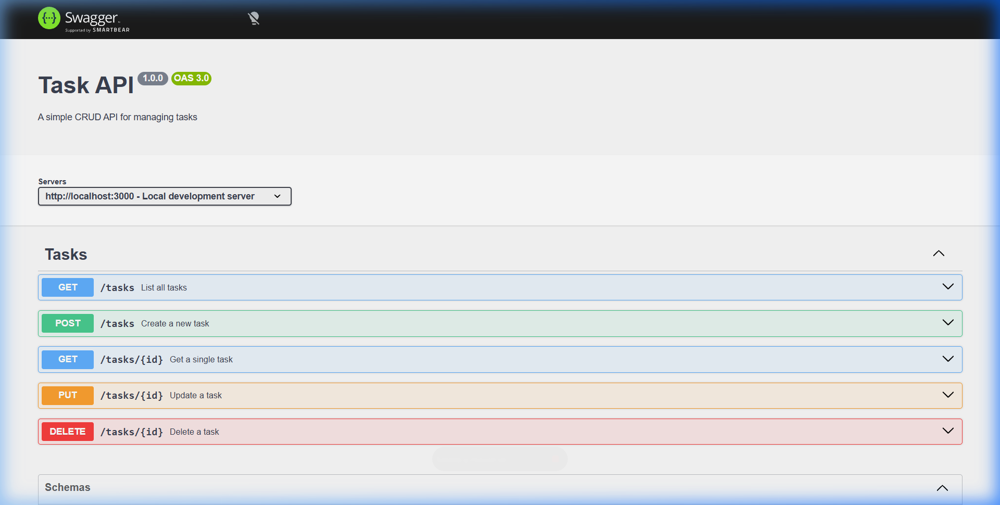

# Task API

A lightweight RESTful CRUD API for managing tasks, built with **Express 5**.  
Includes interactive API documentation powered by **Swagger UI**.

## Install & Run

```bash
npm install && npm start
```

The server starts on **http://localhost:3000**.  
Interactive API docs are at **http://localhost:3000/docs**.

## Endpoints

| Method   | Path          | Description                                      | Success |
| -------- | ------------- | ------------------------------------------------ | ------- |
| `GET`    | `/`           | API info (name, version, available endpoints)     | `200`   |
| `GET`    | `/health`     | Health check                                      | `200`   |
| `GET`    | `/tasks`      | List all tasks                                    | `200`   |
| `GET`    | `/tasks/:id`  | Get a single task by ID                           | `200`   |
| `POST`   | `/tasks`      | Create a new task (body: `{ "title": "..." }`)    | `201`   |
| `PUT`    | `/tasks/:id`  | Update title and/or done status of a task         | `200`   |
| `DELETE` | `/tasks/:id`  | Delete a task by ID                               | `204`   |

## Example: `curl -i`

```
$ curl -i http://localhost:3000/tasks

HTTP/1.1 200 OK
X-Powered-By: Express
Content-Type: application/json; charset=utf-8
Content-Length: 148
ETag: W/"94-JczG6DIA1HhXFR6D5gs88lYlsrU"
Date: Thu, 16 Jul 2026 21:30:47 GMT
Connection: keep-alive
Keep-Alive: timeout=5

{
  "tasks": [
    { "id": 1, "title": "Make the bed", "done": true },
    { "id": 2, "title": "Wash the dishes", "done": false },
    { "id": 3, "title": "feed the dog", "done": false }
  ]
}
```

## Swagger UI

Visit [http://localhost:3000/docs](http://localhost:3000/docs) to explore and test every endpoint interactively — no curl needed.


